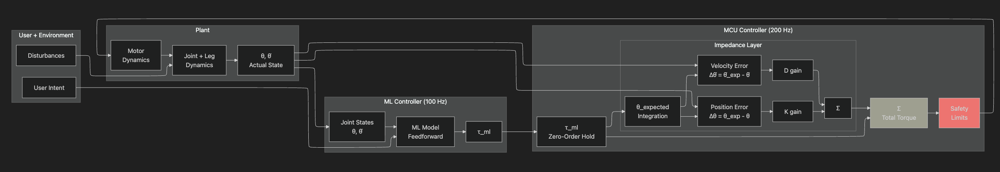

# Controls Algorithm Roadmap

## Document Purpose

This document outlines the implementation roadmap for the McMaster Exoskeleton control algorithm, from basic torque application (Phase 1) to adaptive control (Phase 3).

## Control Objective

### The Challenge

The ML team provides **torque commands** (τ_ml) representing predicted assistive torque. The control system must:

1. Apply ML torque while adding smoothing and compliance
2. Make movement feel natural and assistive (not rigid or robotic)
3. Allow the user to override if they want to move differently
4. Handle ML dropouts gracefully
5. Ensure safety at all times

**Design principle:** **Assist** (reduce effort) without **constraining** (fighting the user's intent)

### Our Approach

**ML Feedforward + Impedance Smoothing + Exoskeleton Compensation**

The ML model provides the primary assistive torque (τ_ml), while local controllers add smoothing, compliance, and transparency.

**Complete Control Equation:**
```
τ_command = τ_ml + τ_impedance + τ_compensation + τ_soft_limits

where:
  τ_ml           = Feedforward torque from ML model (100 Hz from Pi)
  τ_impedance    = K × (θ_expected - θ_actual) + D × (θ̇_expected - θ̇_actual) (200 Hz on MCU)
  τ_compensation = τ_gravity + τ_inertia (cancels exoskeleton's own dynamics)
  τ_soft_limits  = Restoring torque near joint ROM limits
```

**Why this works:**
- **ML model** (77% accuracy, ±0.5 Nm RMSE): Good enough to be the primary controller
- **Impedance layer** (small K, moderate D): Acts as smoothing layer and allows user override
- **Compensation**: Makes exoskeleton feel "weightless" by canceling its own mass/inertia
- **Soft limits**: Prevents joint damage before mechanical hard stops
- **Key insight:** Impedance is NOT trying to track a position — it smooths between ML updates and provides compliance



---

## Quick Reference

### System Timing

| Component | Frequency | Period | Notes |
|-----------|-----------|--------|-------|
| MCU control loop | 200 Hz | 5 ms | Primary real-time control rate |
| ML inference | 100 Hz | 10 ms | Predicts τ_ml torque commands |
| Sensor publish (MCU → Pi) | 100 Hz | 10 ms | Every other MCU control iteration |

**Key relationship:** MCU runs 2 control iterations per ML update

### Phase Progression

| Phase | Goal | Controller | Key Deliverable |
|-------|------|------------|-----------------|
| **1** | Validate pipeline | Direct ML torque + safety | End-to-end system works |
| **2** | Add smoothing | ML feedforward + impedance | Natural feel, user override |
| **3** | Context-aware | Adaptive K/D per gait phase | Optimized per activity |

---

## Impedance Control Fundamentals

### What is Impedance Control?

In mechanics, **impedance** describes how a system responds to motion:

**Force = Impedance × Motion**

| Impedance Level | Behavior | Example |
|----------------|----------|---------|
| High | Resists motion | Stiff wall |
| Low | Yields to motion | Soft sponge |

### The Key Difference

| Control Type | Goal | User Experience |
|--------------|------|-----------------|
| **Position Control (PID)** | "Get to position X at all costs" | Controller fights user if they deviate |
| **Impedance Control** | "Define how it should feel to interact" | User can override with moderate force |

**For an assistive exoskeleton:** We want a **helpful guide**, not a rigid constraint.

### The Impedance Equation

For a single joint:

```
τ = K × (θ_target - θ_actual) + D × (θ̇_target - θ̇_actual)
```

| Symbol | Meaning | Units |
|--------|---------|-------|
| τ | Torque command to motor | Nm |
| K | Stiffness (virtual spring) | Nm/rad |
| D | Damping (virtual damper) | Nm·s/rad |
| θ_target, θ_actual | Target and actual joint angle | deg |
| θ̇_target, θ̇_actual | Target and actual joint velocity | deg/s |

### Physical Intuition

Think of a **virtual spring and damper** connecting target to actual position:

- **Spring (K):** Pulls joint toward target (higher K = stronger pull)
- **Damper (D):** Resists fast motion (higher D = more sluggish)

### What the User Feels

| K | D | User Experience |
|---|---|-----------------|
| Low | Low | Very soft, minimal guidance, full user control |
| High | Low | Strong pull but snappy/oscillatory |
| Low | High | Soft but sluggish (like moving through honey) |
| High | High | Strong pull, smooth but forceful |

**For our system:** Small K + Moderate D → gentle smoothing that allows override

### Why Not Pure PID?

| Scenario | PID Behavior | Impedance Behavior |
|----------|--------------|-------------------|
| User deviates from target | Controller pushes harder to correct | Controller provides proportional resistance |
| User pushes back | Fight escalates | User can override |
| Goal | Zero tracking error | Natural interaction |

**With PID:** "Get to 30° and stay there no matter what"
**With Impedance:** "Pull toward 30° with X Nm per degree of deviation"

---

## Additional Control Components

### Adaptive Trajectory Tracking

**Problem:** Rigid integration of θ_expected can fight natural human limb dynamics.

**Solution:** Use adaptive tracking that follows actual position with lag:

```
θ_expected += α × (θ_actual - θ_expected)    // α = 0.5 (α final value TBD)
θ̇_expected = (θ_expected - θ_expected_prev) / dt
```

**Effect:**
- Allows natural deviations (knee buckling, involuntary adjustments)
- Only resists *rapid* deviations
- User can deviate freely over time scales > ~50ms
- No implicit position-hold behavior

### Exoskeleton Dynamics Compensation

**Problem:** Exoskeleton's own mass and inertia burden the user.

**Solution:** Feedforward compensation for gravity and inertia:

```
τ_gravity = m_link × g × L_com × cos(θ)    // Exo weight
τ_inertia = I_link × θ̈                     // Exo inertia
τ_compensation = τ_gravity + τ_inertia
```

**Required from Mechanical team:**
- m_link: Mass of each link (kg)
- L_com: Center of mass location (m from joint)
- I_link: Moment of inertia (kg·m²)

**Effect:** Makes exoskeleton feel "weightless" to the user.

### Soft Joint Limits

**Problem:** Relying on mechanical hard stops is dangerous.

**Solution:** Software limits with progressive restoring torque:

```
// Define safe range (margins TBD with Mechanical)
θ_min_soft = θ_min_hard + margin     // e.g., 0° + 5° = 5°
θ_max_soft = θ_max_hard - margin     // e.g., 120° - 5° = 115°

// Progressive restoring torque
if θ < θ_min_soft:
    violation = (θ_min_soft - θ) / margin
    τ_soft_limits = -K_limit × violation   // ~50 Nm/rad

if θ > θ_max_soft:
    violation = (θ - θ_max_soft) / margin
    τ_soft_limits = -K_limit × violation
```

**Effect:** Smooth resistance as joint approaches limits, prevents hard stop impacts.

---

## Implementation Phases

## Phase 1: Direct ML Torque + Safety

### Goal

**Validate the end-to-end pipeline:** ML → Pi → MCU → Motor → Joint moves

**Priority:** Get the system working, validate ML torque predictions

### What You're Building

A simple pass-through controller that applies ML torque with safety limits.

**Control Logic (every 5 ms on MCU):**
1. Check if ML command is fresh (age < 20 ms)
   - If fresh → use τ_ml_effective = τ_ml
   - If stale → use τ_ml_effective = 0 (fallback)
2. Compute compensation: τ_compensation = m_link × g × L_com × cos(θ) + I_link × θ̈
3. Compute soft limits: τ_soft_limits (if near ROM boundaries)
4. Combine: τ_command = τ_ml_effective + τ_compensation + τ_soft_limits
5. Apply torque magnitude limits (clamp to ±τ_max)
6. Apply rate limiting (limit change to ±200 Nm/s × dt)
7. Send command to motor

### Testing Checklist

- [ ] Verify τ_ml arrives from Pi at ~100 Hz
- [ ] Send constant τ_ml, verify motor applies expected torque
- [ ] Verify safety limits prevent excessive torque (try commanding ±50 Nm)
- [ ] Test ML dropout → verify fallback to zero torque
- [ ] Test with realistic ML predictions from actual model

### Success Criteria

✓ Motor applies ML-predicted torque
✓ Safety limits work correctly
✓ Fallback to zero torque on ML timeout
✓ Full pipeline (ML → Pi → MCU → Motor) is functional

---

## Phase 2: ML Feedforward + Impedance Smoothing

### Goal

**Add smoothing and compliance** to make the system feel natural and allow user override.

### What's New

- Add impedance term: `τ_impedance = K × position_error + D × velocity_error`
- Impedance acts as **smoothing layer**, not primary controller
- Small K (smoothing), moderate D (compliance)
- Graceful fallback state machine (Hold → Fade → Transparent)

### Controller Design

**Control Logic (every 5 ms on MCU):**
1. Update expected position with **adaptive tracking** (avoids fighting human dynamics):
   ```
   θ_expected += α × (θ_actual - θ_expected)    // α = 0.5
   θ̇_expected = (θ_expected - θ_expected_prev) / dt
   ```
2. Compute impedance: `τ_impedance = K × (θ_expected - θ_actual) + D × (θ̇_expected - θ̇_actual)`
3. Get effective ML torque (using fallback state machine)
4. Compute compensation: `τ_compensation = m_link × g × L_com × cos(θ) + I_link × θ̈`
5. Compute soft limits: `τ_soft_limits` (if near ROM boundaries)
6. Combine: `τ_command = τ_ml_effective + τ_impedance + τ_compensation + τ_soft_limits`
7. Apply safety limits (magnitude, rate)
8. Send command to motor

**Key improvement:** Adaptive tracking (step 1) prevents the impedance controller from fighting natural human limb dynamics like knee buckling during stance or involuntary stabilization adjustments.

### Fallback State Machine

| State | Condition | τ_ml_effective | User Experience |
|-------|-----------|----------------|-----------------|
| **Normal** | ML age ≤ 20 ms | τ_ml (use latest) | Normal operation |
| **Hold** | 0–100 ms after stale | τ_ml (hold last) | Tolerates brief hiccups |
| **Fade** | 100–300 ms after stale | τ_ml × fade_factor | Smooth transition |
| **Transparent** | > 300 ms after stale | 0 (zero torque) | User moves freely |

**Design principle:** No surprises — graceful degradation, smooth transitions

### Testing Checklist

- [ ] User can walk normally with exo powered on
- [ ] User feels ML-provided assistance (compare to Phase 1)
- [ ] Movement is smooth despite 100 Hz ML updates
- [ ] User can deliberately deviate (compliance test)
- [ ] ML dropout triggers graceful fallback (no jarring transitions)
- [ ] No oscillations or vibrations during normal walking
- [ ] Works at different walking speeds

### Success Criteria

✓ Smooth assistance despite discrete ML updates
✓ User can override when they want to move differently
✓ Graceful degradation on ML dropout
✓ Stable across different walking speeds and activities

---

## Phase 3: Adaptive Parameters

### Goal

**Vary impedance parameters based on context** (gait phase, activity) to optimize performance.

### Rationale

Different situations need different smoothing/compliance:

| Situation | Desired Feel | K | D | Why |
|-----------|--------------|---|---|-----|
| Swing phase (leg in air) | More responsive | Slightly higher | Moderate | Less user resistance in air |
| Stance phase (foot on ground) | More user control | Lower | Higher | User needs control when loaded |
| High activity (running, stairs) | Tighter tracking | Slightly higher | Moderate | Faster dynamics |
| Detected stumble | Don't interfere | ~0 | ~0 | Safety — get out of the way |

**Note:** ML still provides the primary assistance. We're tuning the **smoothing/compliance layer**, not the assistive torque.

### Gait Phase Detection

**Options for detecting gait phase:**
- **IMU data:** Orientation and acceleration patterns
- **Joint angles:** Known patterns for swing vs stance
- **ML model:** Can provide gait phase alongside torque command
- **Simple heuristics:** Thresholds on joint velocity, angle ranges

**Basic gait cycle:**
- **Stance (~60%):** Foot on ground — heel strike → foot flat → mid-stance → heel off
- **Swing (~40%):** Foot in air — toe off → mid-swing → terminal swing

**Start simple:** Begin with joint angle thresholds, refine later.

### Testing Checklist

- [ ] Gait phase detection is reasonably accurate (>80%)
- [ ] Transitions between phases feel smooth (no jerks)
- [ ] Swing phase feels more responsive than Phase 2
- [ ] Stance phase allows more user control
- [ ] Safety fallback activates appropriately
- [ ] Works across different walking speeds
- [ ] Compare user feedback to Phase 2

### Success Criteria

✓ Phase-appropriate impedance improves user experience vs Phase 2
✓ Smooth transitions between gait phases
✓ System feels more adaptive and natural
✓ No degradation in safety or stability

---

## Safety Specification

All phases must enforce these limits.

### Torque Limits

All torque commands clamped to safe maximums before motor:

| Joint | Maximum Torque | Status |
|-------|----------------|--------|
| Hip | ±30 Nm | **To be confirmed with Embedded/Mechanical** |
| Knee | ±25 Nm | **To be confirmed with Embedded/Mechanical** |

**Implementation:** Simple clamp before sending to motor
```
tau_command = clamp(tau_command, -tau_max, tau_max)
```

### Rate Limiting

Prevent sudden torque changes:

**Maximum rate:** 200 Nm/s (adjust if needed based on testing)

**Logic:**
```
delta_tau = tau_command - tau_previous
if abs(delta_tau) > TAU_RATE_MAX * dt:
    tau_command = tau_previous + sign(delta_tau) * TAU_RATE_MAX * dt
```

**Purpose:** Prevents jarring acceleration, protects motor/gearbox

### Data Validity Checks

Before computing torque, verify sensor data is valid:

| Check | Threshold | Action on Failure |
|-------|-----------|-------------------|
| Encoder angle | ±143° | Set τ = 0 (transparent) |
| Encoder angle | Not NaN | Set τ = 0 (transparent) |
| Joint velocity | ±458 deg/s | Set τ = 0 (transparent) |
| Joint velocity | Not NaN | Set τ = 0 (transparent) |
| ML command age | < 20 ms | Use fallback state machine |

**On invalid data:** Immediately fall back to zero torque to ensure safety.

### Fallback Behavior

| Condition | Response |
|-----------|----------|
| Invalid sensor data | Zero torque (transparent mode) |
| Stale ML (0–100 ms) | Hold last τ_ml |
| Stale ML (100–300 ms) | Linear fade τ_ml → 0 |
| Stale ML (>300 ms) | Zero torque (transparent mode) |
| User emergency stop | Immediate zero torque |

**Design goals:**
1. Tolerate brief hiccups (Hold phase)
2. Smooth transition to safe state (Fade phase)
3. Never surprise the user

### Hardware Watchdog

If MCU control loop hangs, hardware watchdog should cut motor power.