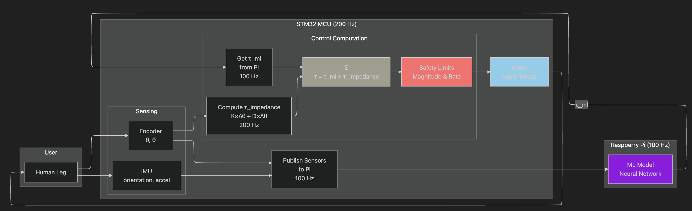
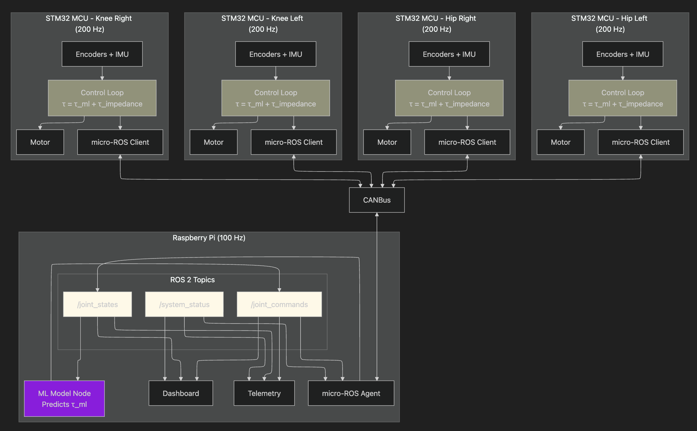

# Controls System Architecture

## Document Purpose

This document captures the architectural decisions and system design for the McMaster Exoskeleton Controls subsystem. It serves as the reference for how the controls system integrates with embedded hardware, the Raspberry Pi, and the broader software stack.

## System Overview

The McMaster Exoskeleton is a lower-limb robotic exoskeleton with four actuated joints:
- Left Hip
- Right Hip
- Left Knee
- Right Knee

### Target Application

The exoskeleton is designed as an **assistive device for firefighters**, augmenting strength and reducing fatigue during demanding tasks:
- Walking and running
- Stair climbing
- Carrying heavy loads

**Design principle:** The control system must **assist** (reduce user effort) without **constraining** (fighting the user's intent). The user must always be able to override the system.

### Hardware Architecture

**Each joint has a dedicated STM32 microcontroller (MCU)** responsible for:
- Reading sensors (encoders, IMUs) at 200 Hz
- Running real-time control loop at 200 Hz
- Combining ML torque commands with local impedance control
- Driving motors via torque/current commands
- Publishing sensor data to Pi at 100 Hz

**A Raspberry Pi** serves as the central coordinator, responsible for:
- Aggregating sensor data from all 4 MCUs
- Running AI/ML inference to predict assistive torque (100 Hz)
- Sending torque feedforward commands back to MCUs
- Hosting the dashboard and telemetry systems

### Sensor Suite

Available sensors per joint:
- **Encoders**: Joint angle (deg) and velocity (deg/s) measurement
- **IMUs**: Orientation and acceleration data


---

## Architecture

| Decision | Choice | Rationale |
|----------|--------|-----------|
| **Communication middleware** | ROS 2 (Humble) on Pi, micro-ROS on MCUs | Unified tooling, standard robotics middleware, good STM32 support |
| **Pi-MCU transport** | CAN bus | Robust, deterministic, common in robotics, already planned by Embedded team |
| **micro-ROS transport** | Custom transport over Embedded's CAN API | Allows micro-ROS without re-implementing low-level CAN drivers |
| **MCU platform** | STM32 | Well-supported by micro-ROS, capable real-time performance |
| **Control loop location** | MCUs (200 Hz) | Safety-critical, must not depend on Pi timing |
| **AI inference location** | Raspberry Pi (100 Hz) | Computational requirements, provides torque feedforward |
| **ML output type** | Torque (Nm) | ML predicts assistive torque directly; MCU adds impedance for smoothing |
| **Control approach** | ML feedforward + impedance smoothing | ML provides primary assistance; impedance adds compliance and safety |
| **Programming languages** | C/C++ for MCU, Python for Pi | Real-time requirements (MCU), ML integration ease (Pi) |
| **ROS 2 distribution** | Humble | LTS, stable, good documentation, Pi compatible |

---

## Control Approach

The system uses **ML feedforward + impedance smoothing + exoskeleton compensation**:

### Complete Control Equation

```
τ_command = τ_ml + τ_impedance + τ_compensation + τ_soft_limits

where:
  τ_ml           = Feedforward torque from ML model (updated at 100 Hz)
  τ_impedance    = K × (θ_expected - θ_actual) + D × (θ̇_expected - θ̇_actual)
  τ_compensation = τ_gravity + τ_inertia (compensate exoskeleton's own dynamics)
  τ_soft_limits  = Restoring torque near joint ROM limits
```

### Role of Each Term

| Term | Description | Source | Role |
|------|-------------|--------|------|
| **τ_ml** | ML-predicted assistive torque | Pi @ 100 Hz | **Primary controller** — provides intelligent assistance |
| **τ_impedance** | Spring-damper smoothing term | MCU @ 200 Hz | **Smoothing layer** — fills gaps between ML updates, allows user override |
| **τ_compensation** | Gravity + inertia compensation | MCU @ 200 Hz | **Transparency** — cancels exoskeleton's own mass/inertia |
| **τ_soft_limits** | Joint limit protection | MCU @ 200 Hz | **Safety** — prevents joint hyperextension/overflexion |

**ML model performance:**
- Accuracy: 77%
- RMSE: ±0.5 Nm
- Good enough to be the primary controller

**Impedance parameters:**
- **K** (stiffness): Small (2–5 Nm/rad) — smoothing role only
- **D** (damping): Moderate (1–3 Nm·s/rad) — provides compliance and allows user override

**Key insight:** The impedance term is NOT trying to track a position. It smooths between ML updates and provides compliance. The user can always override with moderate force.

### Expected Trajectory Tracking (θ_expected)

To avoid fighting natural human limb dynamics, θ_expected uses **adaptive tracking** rather than rigid integration:

```
θ_expected += α × (θ_actual - θ_expected)    // α = 0.5 (α final value TBD)
θ̇_expected = (θ_expected - θ_expected_prev) / dt
```

**Rationale:**
- Allows natural deviations (knee buckling during stance, involuntary adjustments)
- Only resists *rapid* deviations, not slow biomechanical changes
- User can freely deviate over time scales > ~50ms
- Prevents implicit position-hold behavior that fights user intent

### Exoskeleton Dynamics Compensation

The exoskeleton's own mass and inertia create parasitic torques that burden the user:

```
τ_gravity = m_link × g × L_com × cos(θ)    // Exo weight pulling down
τ_inertia = I_link × θ̈                     // Exo resisting acceleration
```

**Required from Mechanical team:**
- Mass of each exoskeleton link segment (kg)
- Center of mass location for each link (m from joint)
- Moment of inertia for each link (kg·m²)

**Effect:** Without compensation, user must overcome exo weight especially in swing phase. With compensation, exo feels "weightless."

### Soft Joint Limits

Software limits prevent joint damage before mechanical hard stops:

```
// Define safe operating range (to be confirmed with Mechanical)
θ_min_soft = θ_min_hard + margin     // e.g., knee: 0° + 5° = 5°
θ_max_soft = θ_max_hard - margin     // e.g., knee: 120° - 5° = 115°

// Compute limit violation factor
if θ < θ_min_soft:
    violation = (θ_min_soft - θ) / margin
    τ_soft_limits = -K_limit × violation   // Opposing torque

if θ > θ_max_soft:
    violation = (θ - θ_max_soft) / margin
    τ_soft_limits = -K_limit × violation
```

**Parameters (to be tuned):**
- K_limit: ~50 Nm/rad (strong restoring torque near limits)
- margin: 5–10° (safety buffer before hard stop)

See [controls_algorithm_roadmap.md](./controls_algorithm_roadmap.md) for more details



---

## Timing Architecture

### Overview

The system uses **asynchronous timing** with the MCU running faster than ML inference:

| Component | Frequency | Period | Notes |
|-----------|-----------|--------|-------|
| **MCU control loop** | 200 Hz | 5 ms | Primary real-time control rate |
| **MCU sensor publish** | 100 Hz | 10 ms | Every other control iteration |
| **Pi ML inference** | 100 Hz | 10 ms | Predicts τ_ml torque commands |
| **Pi command publish** | 100 Hz | 10 ms | Sends τ_ml to MCUs |

**Key relationship:** MCU runs 2 control iterations per ML update. Between ML updates, the MCU uses the same τ_ml value while the local impedance term provides smoothing.

**Why 200 Hz?**
- Motor max: 500 Hz → need headroom for reliability
- Responsive enough for smooth control
- 2:1 ratio with ML updates (clean synchronization)

---

## High Level System Diagram



---

## Data Flow

### Sensor Data: MCU → Pi (100 Hz)

1. **MCU reads sensors** (every control loop iteration, 200 Hz)
   - Encoder: joint angle (deg), velocity (deg/s)
   - IMU: orientation, acceleration

2. **MCU control loop uses sensor data locally** (200 Hz)
   - Updates θ_expected with adaptive tracking
   - Computes τ_impedance term
   - Computes τ_compensation (gravity + inertia)
   - Computes τ_soft_limits (if near ROM boundaries)
   - Combines: τ_command = τ_ml + τ_impedance + τ_compensation + τ_soft_limits
   - Applies safety limits (magnitude, rate) and sends to motor

3. **MCU publishes sensor data via micro-ROS** (100 Hz, every other iteration)
   - Encoder angles (deg) and velocities (deg/s) are converted to radians and rad/s before publishing (ROS 2 convention)
   - micro-ROS client serializes `sensor_msgs/JointState` message
   - Custom CAN transport sends bytes over CAN bus
   - Message includes: position, velocity, effort (optional), timestamp

4. **Pi micro-ROS agent receives CAN data**
   - CAN transport layer receives bytes from SocketCAN
   - Agent deserializes into ROS 2 message
   - Publishes to `/joint_states` topic

5. **Pi ROS 2 nodes consume /joint_states**
   - **ML Model Node**: Uses data for inference, predicts τ_ml
   - **Telemetry Node**: Logs data, computes diagnostics
   - **Dashboard Node**: Displays to operator

### Commands: Pi → MCU (100 Hz)

1. **ML Model Node predicts desired torque** (100 Hz)
   - Based on current sensor data, gait prediction, user intent
   - Outputs τ_ml for each joint

2. **ML Node publishes to /joint_commands topic**
   - Custom message includes: τ_ml (feedforward torque) per joint

3. **micro-ROS Agent receives command**
   - Subscribes to `/joint_commands`
   - Serializes message
   - Sends via CAN transport to appropriate MCU(s)

4. **MCU micro-ROS client receives command**
   - CAN transport receives bytes
   - Deserializes into command struct
   - Updates τ_ml for control loop
   - Timestamp recorded for staleness detection

5. **MCU control loop computes final torque** (200 Hz)
   - Updates θ_expected with adaptive tracking
   - Computes impedance: τ_impedance = K × (θ_expected - θ_actual) + D × (θ̇_expected - θ̇_actual)
   - Computes compensation: τ_compensation = τ_gravity + τ_inertia
   - Computes soft limits: τ_soft_limits (if approaching ROM boundaries)
   - Combines: τ_command = τ_ml + τ_impedance + τ_compensation + τ_soft_limits
   - Applies safety limits (magnitude, rate)
   - Sends to motor
   - Uses same τ_ml until next command arrives (2 iterations)

## ROS 2 Integration (not finalized)

### Topics and Messages

| Topic | Direction | Message Type | Rate | Description |
|-------|-----------|--------------|------|-------------|
| `/joint_states` | MCU → Pi | `sensor_msgs/JointState` | 100 Hz | Position, velocity, effort for all joints |
| `/joint_commands` | Pi → MCU | Custom (to be defined) | 100 Hz | τ_ml (feedforward torque) for each joint |
| `/system_status` | MCU → Pi | Custom (to be defined) | ~10 Hz | Health, errors, warnings per MCU |
| `/diagnostics` | Pi internal | `diagnostic_msgs/DiagnosticArray` | ~1 Hz | Aggregated system diagnostics |

### Message Definitions

#### `/joint_states` (sensor_msgs/JointState)

Standard ROS 2 message. No custom definition needed.

**Contents:**
```yaml
header:
  stamp: timestamp
  frame_id: "base_link"
name: ["hip_left", "hip_right", "knee_left", "knee_right"]
position: [θ₁, θ₂, θ₃, θ₄]  # radians (converted from encoder degrees)
velocity: [θ̇₁, θ̇₂, θ̇₃, θ̇₄]  # rad/s (converted from encoder deg/s)
effort: [τ₁, τ₂, τ₃, τ₄]     # Nm (optional, from motor current)
```

#### `/joint_commands` (custom)

**Proposed structure** (to be finalized):
```yaml
header:
  stamp: timestamp
name: ["hip_left", "hip_right", "knee_left", "knee_right"]
effort: [τ_ml₁, τ_ml₂, τ_ml₃, τ_ml₄]  # Nm (feedforward torque from ML)
```

**Status:** Needs definition in custom message package

### micro-ROS Integration

**What is micro-ROS?**
A lightweight subset of ROS 2 designed for microcontrollers. Allows MCUs to be "first-class citizens" in the ROS 2 ecosystem while maintaining real-time performance.

**Key components:**
- **micro-ROS Client** (on MCU): Minimal ROS 2 node running on STM32
- **micro-ROS Agent** (on Pi): Bridges MCU clients to full ROS 2 graph
- **Custom CAN Transport**: Wraps Embedded team's CAN API for micro-ROS communication

**Why custom transport?**
Embedded team provides a CAN API (not ROS-native). Controls team writes a thin wrapper that implements the micro-ROS transport interface, calling Embedded's API underneath. This avoids re-implementing low-level CAN drivers.

## Important Resources

**ROS 2 and micro-ROS:**
- [ROS 2 Humble documentation](https://docs.ros.org/en/humble/)
- [micro-ROS documentation](https://micro.ros.org/)
- [micro-ROS for STM32CubeMX](https://github.com/micro-ROS/micro_ros_stm32cubemx_utils)
